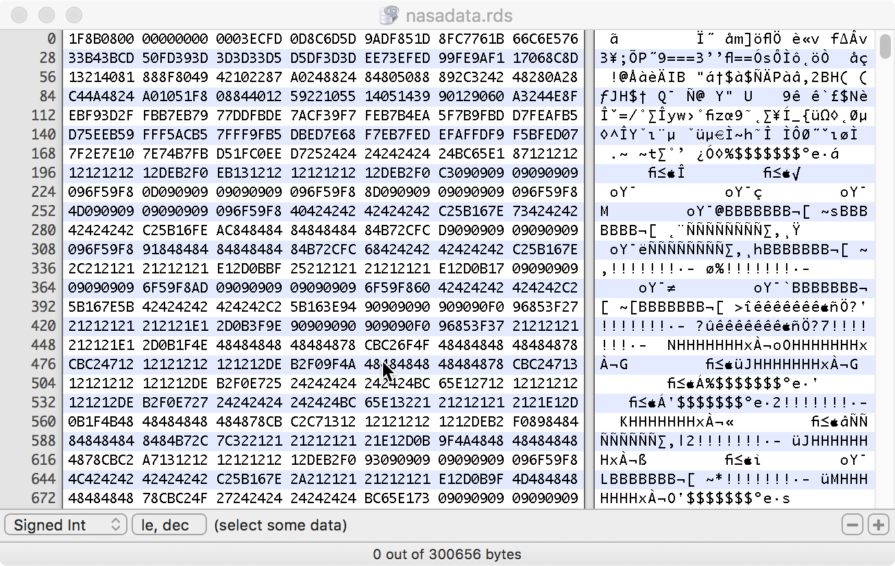
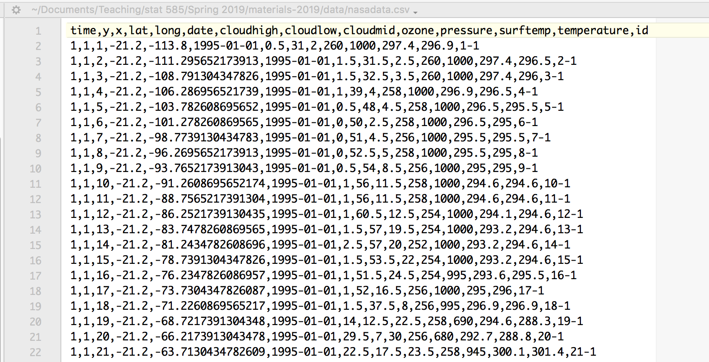

# Text files versus binary files

- text files are all formats that are humanly readable, i.e. we can open the files in a text editor and read the contents

- binary files encode contents in a machine readable form

- What are the pros and cons?

---

# nasa data - binary file



---

# nasa data - text file



---

# Text files and R

- base R supports reading text files, e.g. `read.table(), read.csv(), read.delim()` reads data from  text files files with specified delimiters 

- `write.table()` writes  text files files

- the `readr` package provides similar functionality: `read_csv, read_tsv, read_delim`

- `readr` functions are faster than base R functions, if the whole file is being read at once

- all of the text files have to be highly structured to be readable


---

## Binary files and R

- `saveRDS()` saves a single R object in binary format, use extension `.rds`

- `readRDS()` reads R binary file

- `save()` saves all objects in a binary file (and keeps their names), use extension `.rda` 

- `load()` retrieves these objects (using the same names)

---

## Example

```{r}
system.time(d1 <- read.csv("../data/nasadata.csv"))
system.time(d2 <- readRDS("../data/nasadata.rds"))
```

speed-up is about factor 10 in favor of binary files


---

# Binary file formats

- No restriction in terms on content, streams of bytes

- Advantage: Generally much smaller files, and with compression even smaller, e.g. `nasadata.csv` is 3.7Mb, `nasadata.rds` is 288kb

- Disadvantage:  

    - introduce a dependency on software (what if in a future version of the software our old binary file cannot be read anymore?) 
    - potential of dependency on operating system
    - file corruption is not recoverable

---

# Text file formats

- humanly readable does not necessarily mean well-structured or nicely readable

- in R we are often dealing with csv, i.e. column separated values

- sometimes we deal with tsv (separated by tabulator)

- we will look at a few different file formats

---

# JSON

- JSON is short for JavaScript  Object Notation (http://json.org/) 

- it is a lightweight data interchange format, becoming increasingly popular

- Human readable and writable

- Utilized by many web APIs, e.g. tumblr, twitter, ... 


---

# JSON - example 

e.g. result from get query in JSON format:

```
 [{"P0010001":710231,"NAME":"Alaska","state":"02"},
 {"P0010001":4779736,"NAME":"Alabama","state":"01"},
 {"P0010001":2915918,"NAME":"Arkansas","state":"05"},
 {"P0010001":6392017,"NAME":"Arizona","state":"04"},
 {"P0010001":37253956,"NAME":"California","state":"06"}]
```

i.e. vector of key-value format - focus is on individual rows in a data set, whereas R puts emphasis on individual columns (data set is list of vectors).

advantage: enables streaming data, i.e new observations can easily be added as they become available

disadvantage: operations across observations are tricky

---
class: inverse
# Your Turn

The package `jsonlite` (part of the `tidyverse`) has functions `toJSON` and `fromJSON` to transform between JSON data and R objects. 

- convert the first three observations from data `mtcars` into JSON format (use `pretty = TRUE` to make things readable)

- copy the five lines from the previous slides into a character object. Use `fromJSON` to create an R object from it. What object do you get?

---
class: inverse
# Your Turn - Hard

The Census Bureau provides access to some of its data through an API, which returns json (like) data.

The call `https://api.census.gov/data/2010/surname?get=NAME,COUNT&RANK=1:100` returns values for surname and counts for the top 100 rank surnames of the 2010 surname table.

```
[["NAME","COUNT","RANK"],
["ADAMS","427865","42"],
["ALLEN","482607","33"],
["ALVAREZ","233983","92"],
["ANDERSON","784404","15"],
["BAILEY","277845","72"],
["BAKER","419586","44"],
...
]
```

Change the above call to include additional data on demographics (see [variables for surname data](https://api.census.gov/data/2010/surname/variables.html)) and read it into your R session.  

Is your last name included? At what rank? what is the change in rank since 2000?

---

```{r}
jsonlite::toJSON(mtcars[1:2,], pretty=TRUE)
```

---

```{r}
char <- '[{"P0010001":710231,"NAME":"Alaska","state":"02"},
 {"P0010001":4779736,"NAME":"Alabama","state":"01"},
 {"P0010001":2915918,"NAME":"Arkansas","state":"05"},
 {"P0010001":6392017,"NAME":"Arizona","state":"04"},
 {"P0010001":37253956,"NAME":"California","state":"06"}]'

str(jsonlite::fromJSON(char))
```
---

```{r}
query <- "https://api.census.gov/data/2010/surname?get=NAME,COUNT,PCTWHITE,PCTBLACK,PCTHISPANIC&RANK=1:100"

surnames <- jsonlite::fromJSON(query)

head(surnames, 10)
```

result is a matrix - it will need some work to turn into a data frame
---

# Navel gazing

```{r}
us2010 <- jsonlite::fromJSON("https://api.census.gov/data/2010/surname?get=NAME,COUNT,RANK,PCTWHITE,PCTBLACK&NAME=HOFMANN&NAME=VANDERPLAS")
us2000 <- jsonlite::fromJSON("https://api.census.gov/data/2000/surname?get=NAME,COUNT,RANK,PCTWHITE,PCTBLACK&NAME=HOFMANN&NAME=VANDERPLAS")

us2000
us2010
```

---

# HTML FILES

- A lot of data is available online in the form of html tables

- Extracting the data requires recognizing the html table format, and stripping off the html

- Packages such as `xml`, `rvest`, ... helps with this

---

# HTML FILES

  Pulling election results off the web...

```{r warnings=FALSE, message=FALSE}
library(rvest)
url <- "https://www.nytimes.com/elections/results/iowa-house-district-4"
doc <- read_html(url)
tables <- html_table(doc, fill=TRUE)
head(tables[[2]])
```


---
  
# Other binary formats and R
  
  - Packages `foreign` or `haven`: Data export/import for other (statistical) software: Stata, Epi, Octave, SPSS, Systat, SAS

- Package `readxl` import/export with Excel spreadsheets
e.g. web index data at http://www.visualizing.org/datasets/web-index-2013


---
  
# Why do we need to access all these formats? 
  
  - To solve a problem, may need to collate data from multiple sources

- Rearranging and merging data from different sources helps to pull together the data necessary to solve the problem


