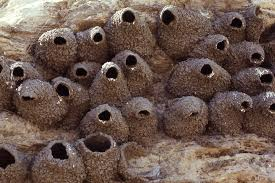

```{r setup, include=FALSE}
knitr::opts_chunk$set(echo = TRUE)
library(tidyverse)
```

# Working with lists

## Lists

- are most general form of objects in R
- `[` accesses sub lists
- `[[` accesses elements
- for well-structured lists more powerful tools: `map` (`purrr`)

## Example: total gross over time

We want to model total gross over time. 

```{r fig.height=3.5}
movies <- read.csv("../data/movies.csv")
captain <- movies %>% filter(Movie=="Captain America: Civil War") 
captain %>% ggplot(aes(x = Days, y = Total.Gross)) + geom_line()
```

## Example: total gross over time (cont'd)

```{r message=FALSE}
library(nlme)
## using a selfStart model
Asym <- max(captain$Total.Gross)
xmid <- 0
scal <- 1
captain.m1 <- nls(Total.Gross ~ SSlogis(Days, Asym, xmid, scal), captain)
summary(captain.m1)
```

## Example: total gross over time (cont'd)

```{r fig.height=3.5}
captain %>% ggplot(aes(x = Days, y = Total.Gross)) + geom_point() +
  geom_line(aes(y = fitted(captain.m1)))
```

Now we would like to repeat this modelling approach to all movies, i.e. *split* by movie, *apply* the model, *combine* the results. 

## Split-Apply-Combine for lists


- both summarize and mutate need vector objects as result, but model results are usually more complicated
- `nest` creates list of data frames (split)
- `map` applies function to list object (apply)
- `unnest` moves list results back into a data frame (combine)


## nest

- `nest` is a function in `tidyr`: creates variable `data`
- `data` is variable of data frames

```{r}
movieList <- movies %>% nest(-Movie, -Release) 
movieList 
```

## Nested data frames

```{r}
movieList$Movie[456]
movieList$data[[456]] %>% arrange(Days)
```

## Your Turn (8 mins) {.white}



<span style="color:white">The goal of this your turn is for you to try out nesting operations on various datasets.</span>

- <span style="color:white">Nest the `ChickWeight` data in different ways: what are the results of </span>

```
ChickWeight %>% nest(-Diet)
ChickWeight %>% nest(weight)
ChickWeight %>% nest(Time, weight)
```

- <span style="color:white">`chickwts` is yet another data set on feeding chicks. Nest it by different feeds. </span>
- <span style="color:white">`nest` respects grouping structure introduced by `group_by`. Use `group_by` to nest the `iris` dataset by species. </span>

##
```{r}
f <-  function(df) {
  # df is data set for one Movie/Release date (like captain)
  Asym <- max(df$Total.Gross)
  xmid <- 0
  scal <- 1
  df.m1 <- nlme::nls(Gross ~ SSlogis(Days, Asym, xmid, scal), df)
  df.m1
}
safe_nls <- safely(f)

movieList$model <- movieList$data %>% purrr::map(.f = safe_nls)
```
