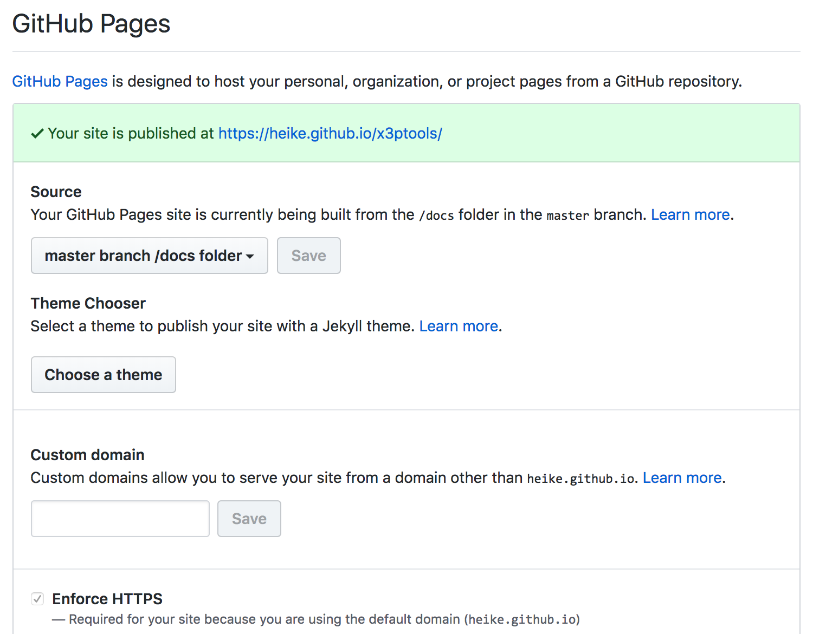

```{r setup, include=FALSE}
options(htmltools.dir.version = FALSE)
```

## Outline

- Another way of setting up a package

- data in packages

- code examples in the help file

- checking a package

<br>
<br>
<br>

Resource: [usethis](https://usethis.r-lib.org/) by Hadley Wickham and Jenny Bryan

---
class: inverse
## Your Turn

`usethis` is a package to help with organizing your workflow in packages and non-package projects

Read through the [README](https://usethis.r-lib.org/) site of `usethis`.

Create a new package using `usethis` functionality. Make sure to not use `tempdir()` as the location for the new package, but a more suitable location.

Use `usethis` functionality to set up a README.Rmd file and a NEWS.md file.

---
class: inverse
## Your Turn

The `usethis` package allows you to directly connect a project to git and github

1. Check with `use_git_config()` that your user name and email are correct for working with github

2. Use `edit_git_config` is they are not correct and fix the information in the file

3. Then use `use_github()` - most likely this will result in an error, unless you have set up a token. Follow the instructions, restart R and try again. 

4. Go to your github page and check whether the new repo is there ... 

---

## Data in a package

Assume we have the data frame `mydata` (you might consider using a better name :)).

- Data frames must be stored in the `data` folder. Use the command `save` and make sure to set the path to write into the folder `data`. Then you need to start the documentation ...

- Data the `usethis` way: `use_data(mydata)`. This will use the information of the RStudio project to save things into the proper path and give you a reminder what to do next.


```
use_data
function (..., internal = FALSE, overwrite = FALSE, compress = "bzip2")
```

`use_data` places a data object into the `data` folder.

internal data (used by the package not by the users of a package) is placed in the file `sysdata.rda`

---
class: inverse
## Your Turn

Add a dataset to your package (e.g. use the `mtcars` data)

How do we document data?

---

## Data documentation

- Documenting data in packages: https://r-pkgs.org/data.html

```
#' Prices of 50,000 round cut diamonds.
#'
#' A dataset containing the prices and other attributes of almost 54,000
#' diamonds.
#'
#' @format A data frame with 53940 rows and 10 variables:
#' \describe{
#'   \item{price}{price, in US dollars}
#'   \item{carat}{weight of the diamond, in carats}
#'   ...
#' }
#' @source \url{http://www.diamondse.info/}
"diamonds"
```


General convention is to have a `data.r` file in the folder R that consists of data documentation.

---

# Examples in packages

- The Roxygen tag `@examples` allows you to write code as an example in the help file.

- Always make use of this feature! It is not only good practice, it is also a first step in checking that your package is running properly

- Your example has to be **stand alone**, i.e. if you are using some data, it needs to be included in the package.

```
#' @examples
#' # you can include comments
#' x <- 1
#' 5*x
#' hello("this is a test")
```

---

# Package website

The package `pkgdown` creates web pages based on all the files in a package

`pkgdown` supports making websites for your package (see e.g. [x3ptools](https://heike.github.io/x3ptools/), [ggplot2](https://ggplot2.tidyverse.org/), ... and soon yours)

Process:

```
pkgdown::build_site()
```


Assuming your package has a github repo, add the `docs` folder to the repo 

In `Settings` for your repo, switch GitHub Pages to the docs folder (see screenshot)

---



---

# Checking packages

- The Comprehensive R Archive Network (CRAN) is the place for publishing packages for general use.

- Once a package is on CRAN it can be installed using the command `install.packages("<package name>")`

- CRAN has installed certain rules that all packages must comply before being uploaded

`devtools::check()` or `Ctrl/Cmd + Shift + E` runs these tests on your local package

Similar to `install()` it looks for the package to check in the working directory

---

# Three levels of faults

- **`ERROR`**: severe problem that has to be fixed beofr esubmitting to CRAN - you should fix it anyway

- **`WARNING`**: also has to be fixed before going onto CRAN, but not as severe.

- **`NOTE`**: mild problem. You should try to get rid of all notes before submitting to CRAN, but sometimes there is a specific reason that does not allow you to fix all notes. In that case, write a careful description why this note happens in the submission comments.

---

# Checking cycle

```
R CMD check results
0 errors | 0 warnings | 0 notes 
```

This is what you want to see, but not a likely outcome of your first run in a real package


Checking workflow: 

1. Run `devtools::check()`, or press `Ctrl/Cmd + Shift + E`.

2. Fix the first problem.

3. Repeat until there are no more problems.


---
class: inverse
# Your turn

What state is your current app in? Run a check to see

Fix the first problem

Run the check again

---

# Likely Problems

- missing documentation for functions and data

```
checking for code/documentation mismatches ... WARNING
Codoc mismatches from documentation object 'hello':
hello
  Code: function(string)
  Docs: function()
  Argument names in code not in docs:
    string
```    

- missing dependencies to other packages

```
checking dependencies in R code ... WARNING
'::' or ':::' import not declared from: ‘stringr’
```
- making assumptions about data structures

```
checking R code for possible problems ... NOTE
hello: no visible binding for global variable ‘string’
```

---

# Continuous Integration

- one of the problems of ensuring that a package is sound, is to actually *remember* to run the tests

- [Github actions](https://github.com/features/actions) allows us to create an automatized workflow (written in yaml): e.g. every time you push a change, the package is being built and checked for CRAN compliance

- github actions can be adjusted to specific use cases - for a start use [example actions](https://github.com/r-lib/actions) :)

- the command `usethis::use_github_actions()` sets up a folder .github > workflows with the  file `R-CMD-check.yaml`.
